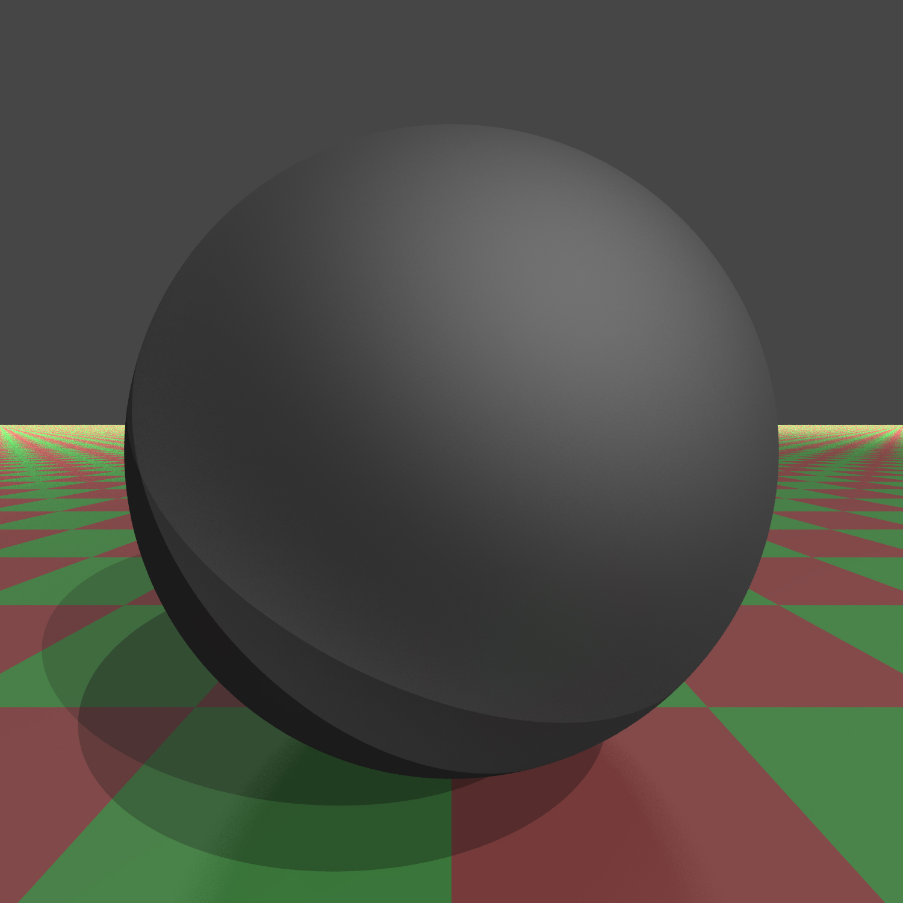

# Ray Tracer

A simple ray tracer written in pure c++. The ray traced renderings are saved in jpg or ppm format. Following are shown some features of the project and example scenes.

## Index
1. materials;
2. antialiasing - supersampling;
3. ambient occlusion;
4. depth of field;
5. random examples;
6. to do;
### Materials
With a number of indices it is possible to specify a wide range of materials, for instance:
|Glass (`Material::rhoe > .0`)| Mirror (`Material::rhor > .0`)|Glossy (`Material::glossy_radius > .0`)|Opaque|Textured|
|-------|--------|--------|--------|--------|
||||||

### Antialising
Antialiasing is managed using supersampling: instead of sending 1 ray for each pixel, we send a bunch of rays (using the `Renderer::setSamples(int)` method) and averaging their color. Let's see an example:
|1 sample|5 samples|100 samples|
|------|-------|--------|
||||
Only using 5 samples dramatically increases the quality of the rendering.

### Ambient occlusion
Ambient occlusion is rendered using a bunch of rays (`feelers` in the code) scattered from the intersection point. The number of collision is then used to adjust the light intensity of the pixel according to an exponential law:
~~~cpp
float collisionFactor = 1.0f - pow(f, alpha);
~~~
where:
1. `f` is the normalized number of intersections of the feelers;
2. `alpha` is a factor that can be tuned to set the intensity of the ambient occlusion;
Let's see how it works:
|No ambient occlusion|Ambient occlusion (`alpha = 3.0f`, `number of feelers = 70`)|
|-----------|----------|
|||

### Depth of field
Depth of field effects are renderer in the following way, given:
1. a focus point `Vector f` ;
2. an aperture `float a` ;
we render the scene multiple times rotating the `Camera` around `f`, with maximum allowed distance from the original position of `a`. Notice that increasing `a` requires an higher number of samples to render a realistic scene.
Here's the effect of the depth of field in a simple scene, with the focus on the reflective sphere:
|1 camera position|15 camera positions|
|--------|--------|
|||

### Random examples
**Infinite corridor:** Effects of the `Material::glossy_radius` and `MAX_RECURSION_DEPTH` can be appreciated in this scene:
|`MAX_RECURSION_DEPTH = 7`|`MAX_RECURSION_DEPTH = 15`|
|-------------|---------|
|||

**Refraction & DOF** 

**Reflection and dof**

### TO DO

- [ ] soft shadows;
- [ ] motion blur;
- [ ] csg;
- [ ] orthographic view;
- [ ] traingle and mesh support;